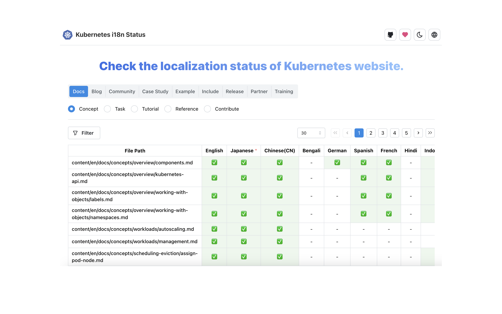

# kube-website-i18n

A dashboard to visualize and track the translation status of Kubernetes website documentation across different languages. This tool helps contributors and maintainers monitor localization progress and identify areas requiring translation efforts.

 

## Features

